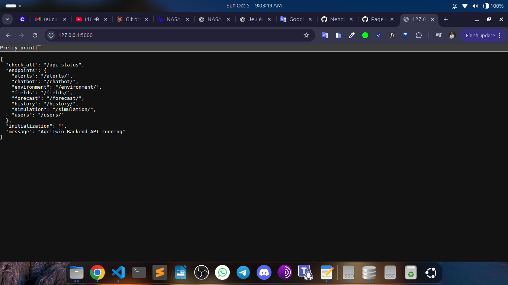
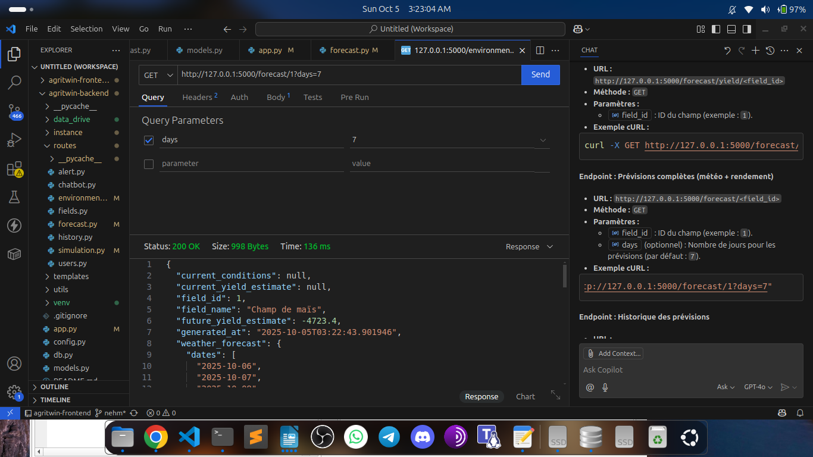
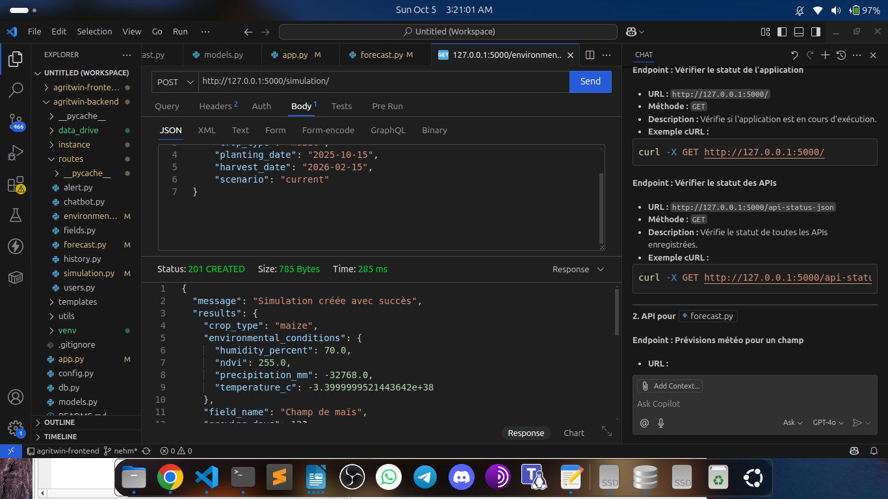

# AgriTwin Backend API - Complete Documentation

> A comprehensive API for intelligent agricultural management with weather forecasting, simulations, and user management

[](https://www.python.org/)
[](https://flask.palletsprojects.com/)
[](https://www.sqlalchemy.org/)
[](LICENSE)

---

## Table of Contents

- [Installation](#installation)
- [Quick Start](#quick-start)
- [Architecture](#architecture)
- [API Endpoints](#api-endpoints)
  - [Users](#1-users)
  - [Fields](#2-fields)
  - [History](#3-history)
  - [Simulation](#4-simulation)
  - [Alerts](#5-alerts)
  - [Chatbot](#6-chatbot)
  - [Forecast](#7-forecast)
  - [Environment](#8-environment)
- [Usage Examples](#usage-examples)
- [Database](#database)
- [Technologies](#technologies)
- [Screenshots](#screenshots)

---

## Installation

### Prerequisites

- Python 3.8 or higher
- pip (Python package manager)
- SQLite or PostgreSQL

### Installation Steps

```bash
# 1. Clone the repository
git clone <your-repo>
cd agritwin-backend

# 2. Create a virtual environment
python3 -m venv venv

# 3. Activate the virtual environment
source venv/bin/activate  # On Linux/Mac
# or
venv\Scripts\activate  # On Windows

# 4. Install dependencies
pip install -r requirements.txt
```

---

## Quick Start

```bash
# Launch the application
python3 app.py
```

The API will be accessible at: `http://127.0.0.1:5000/`

On startup, the application will automatically:
- Create all database tables
- Insert 15 pre-defined crop types
- Create a test user and an agricultural field

---

## Architecture

```
AgriTwin Backend/
├── app.py                 # Main entry point
├── db.py                  # Database configuration
├── models.py              # SQLAlchemy models
├── routes/
│   ├── users.py          # User routes
│   ├── fields.py         # Agricultural field routes
│   ├── history.py        # History routes
│   ├── simulation.py     # Simulation routes
│   ├── alert.py          # Alert routes
│   ├── chatbot.py        # Chatbot routes
│   ├── forecast.py       # Forecast routes
│   └── environment.py    # Environment routes
└── templates/
    └── api_status.html   # API status page
```

---

## API Endpoints

### Main Endpoint

#### Home Page

```http
GET /
```

**Response:**
```json
{
  "message": "AgriTwin Backend API running",
  "initialization": "...",
  "endpoints": {
    "users": "/users/",
    "fields": "/fields/",
    "history": "/history/",
    "simulation": "/simulation/",
    "alerts": "/alerts/",
    "chatbot": "/chatbot/",
    "forecast": "/forecast/",
    "environment": "/environment/"
  },
  "check_all": "/api-status"
}
```

#### All APIs Status (JSON)

```http
GET /api-status-json
```

#### All APIs Status (HTML)

```http
GET /api-status
```

---

### 1. **Users**

#### Create a User

```http
POST /users/
```

**JSON Body:**
```json
{
  "lastname": "Smith",
  "firstname": "John",
  "email": "john.smith@example.com",
  "phone": "0123456789",
  "password": "password123",
  "language": "en"
}
```

**cURL Example:**
```bash
curl -X POST http://127.0.0.1:5000/users/ \
  -H "Content-Type: application/json" \
  -d '{
    "lastname": "Smith",
    "firstname": "John",
    "email": "john.smith@example.com",
    "phone": "0123456789",
    "password": "password123",
    "language": "en"
  }'
```

**Response:**
```json
{
  "message": "Utilisateur créé",
  "id": 1
}
```

---

#### User Login

```http
POST /users/login
```

**JSON Body:**
```json
{
  "phone": "0123456789",
  "password": "password123"
}
```

**cURL Example:**
```bash
curl -X POST http://127.0.0.1:5000/users/login \
  -H "Content-Type: application/json" \
  -d '{
    "phone": "0123456789",
    "password": "password123"
  }'
```

**Response (success):**
```json
{
  "message": "Connexion réussie",
  "user": {
    "id": 1,
    "lastname": "Smith",
    "firstname": "John",
    "email": "john.smith@example.com",
    "phone": "0123456789",
    "language": "en"
  }
}
```

**Response (failure):**
```json
{
  "message": "Échec de l'authentification"
}
```

---

#### List All Users

```http
GET /users/
```

**cURL Example:**
```bash
curl http://127.0.0.1:5000/users/
```

**Response:**
```json
[
  {
    "id": 1,
    "lastname": "Smith",
    "firstname": "John",
    "email": "john.smith@example.com",
    "phone": "0123456789",
    "language": "en"
  }
]
```

---

#### Get User by ID

```http
GET /users/<user_id>
```

**cURL Example:**
```bash
curl http://127.0.0.1:5000/users/1
```

---

#### Update a User

```http
PUT /users/<user_id>
```

**JSON Body:**
```json
{
  "lastname": "Johnson",
  "firstname": "Peter",
  "email": "peter.johnson@example.com",
  "phone": "0987654321",
  "password": "newpassword",
  "language": "fr"
}
```

**cURL Example:**
```bash
curl -X PUT http://127.0.0.1:5000/users/1 \
  -H "Content-Type: application/json" \
  -d '{
    "lastname": "Johnson",
    "email": "peter.johnson@example.com"
  }'
```

**Response:**
```json
{
  "message": "Utilisateur mis à jour"
}
```

---

#### Delete a User

```http
DELETE /users/<user_id>
```

**cURL Example:**
```bash
curl -X DELETE http://127.0.0.1:5000/users/1
```

**Response:**
```json
{
  "message": "Utilisateur supprimé"
}
```

---

### 2. **Fields**

Field management endpoints are available under `/fields/`

---

### 3. **History**

History endpoints are available under `/history/`

---

### 4. **Simulation**

#### Create a Simulation

```http
POST /simulation/
```

**JSON Body:**
```json
{
  "field_id": 1,
  "scenario": "drought",
  "parameters": {
    "temperature": 35,
    "rainfall": 10
  }
}
```

**cURL Example:**
```bash
curl -X POST http://127.0.0.1:5000/simulation/ \
  -H "Content-Type: application/json" \
  -d '{
    "field_id": 1,
    "scenario": "drought",
    "parameters": {
      "temperature": 35,
      "rainfall": 10
    }
  }'
```

---

#### List Simulations for a Field

```http
GET /simulation/field/<field_id>
```

**cURL Example:**
```bash
curl http://127.0.0.1:5000/simulation/field/1
```

---

#### Simulation Details

```http
GET /simulation/<simulation_id>
```

**cURL Example:**
```bash
curl http://127.0.0.1:5000/simulation/1
```

---

#### Delete a Simulation

```http
DELETE /simulation/<simulation_id>
```

**cURL Example:**
```bash
curl -X DELETE http://127.0.0.1:5000/simulation/1
```

---

### 5. **Alerts**

Alert endpoints are available under `/alerts/`

---

### 6. **Chatbot**

Chatbot endpoints are available under `/chatbot/`

---

### 7. **Forecast**

#### Weather Forecast for a Field

```http
GET /forecast/weather/<field_id>?days=7
```

**Parameters:**
- `field_id`: Field ID (required)
- `days`: Number of days (optional, default: 7, max: 30)

**cURL Example:**
```bash
curl "http://127.0.0.1:5000/forecast/weather/1?days=7"
```

---

#### Yield Forecast

```http
GET /forecast/yield/<field_id>
```

**cURL Example:**
```bash
curl http://127.0.0.1:5000/forecast/yield/1
```

---

#### Complete Forecast (weather + yield)

```http
GET /forecast/<field_id>?days=7
```

**cURL Example:**
```bash
curl "http://127.0.0.1:5000/forecast/1?days=7"
```

---

#### Forecast History

```http
GET /forecast/history/<field_id>
```

**cURL Example:**
```bash
curl http://127.0.0.1:5000/forecast/history/1
```

---

### 8. **Environment**

#### Environmental Data for a Field

```http
GET /environment/<field_id>
```

**Description:** Returns environmental data extracted from `.tif` files

**cURL Example:**
```bash
curl http://127.0.0.1:5000/environment/1
```

---

#### List All Raster Files

```http
GET /environment/files
```

**cURL Example:**
```bash
curl http://127.0.0.1:5000/environment/files
```

---

#### Download from Google Drive

```http
POST /environment/download-drive
```

**cURL Example:**
```bash
curl -X POST http://127.0.0.1:5000/environment/download-drive
```

---

#### Add Environmental Data

```http
POST /environment
```

**JSON Body:**
```json
{
  "field_id": 1,
  "temperature": 28.5,
  "humidity": 65,
  "rainfall": 12.3
}
```

**cURL Example:**
```bash
curl -X POST http://127.0.0.1:5000/environment \
  -H "Content-Type: application/json" \
  -d '{
    "field_id": 1,
    "temperature": 28.5,
    "humidity": 65,
    "rainfall": 12.3
  }'
```

---

#### Update Environmental Data

```http
PUT /environment/<data_id>
```

**JSON Body:**
```json
{
  "temperature": 30.0,
  "humidity": 70
}
```

**cURL Example:**
```bash
curl -X PUT http://127.0.0.1:5000/environment/1 \
  -H "Content-Type: application/json" \
  -d '{
    "temperature": 30.0,
    "humidity": 70
  }'
```

---

#### Delete Environmental Data

```http
DELETE /environment/<data_id>
```

**cURL Example:**
```bash
curl -X DELETE http://127.0.0.1:5000/environment/1
```

---

## Usage Examples

### With Python (requests)

```python
import requests

BASE_URL = "http://127.0.0.1:5000"

# 1. Create a user
user_data = {
    "lastname": "Smith",
    "firstname": "John",
    "email": "john.smith@example.com",
    "phone": "0123456789",
    "password": "password123",
    "language": "en"
}
response = requests.post(f"{BASE_URL}/users/", json=user_data)
print(response.json())

# 2. Login
login_data = {
    "phone": "0123456789",
    "password": "password123"
}
response = requests.post(f"{BASE_URL}/users/login", json=login_data)
user = response.json()
print(f"Logged in as: {user['user']['firstname']}")

# 3. Get weather forecast
response = requests.get(f"{BASE_URL}/forecast/weather/1?days=7")
weather_data = response.json()
print(weather_data)

# 4. Create a simulation
simulation_data = {
    "field_id": 1,
    "scenario": "drought",
    "parameters": {
        "temperature": 35,
        "rainfall": 10
    }
}
response = requests.post(f"{BASE_URL}/simulation/", json=simulation_data)
print(response.json())

# 5. List all users
response = requests.get(f"{BASE_URL}/users/")
users = response.json()
for user in users:
    print(f"- {user['firstname']} {user['lastname']}")
```

---

### With JavaScript (fetch)

```javascript
const BASE_URL = "http://127.0.0.1:5000";

// 1. Create a user
async function createUser() {
  const userData = {
    lastname: "Smith",
    firstname: "John",
    email: "john.smith@example.com",
    phone: "0123456789",
    password: "password123",
    language: "en"
  };
  
  const response = await fetch(`${BASE_URL}/users/`, {
    method: 'POST',
    headers: { 'Content-Type': 'application/json' },
    body: JSON.stringify(userData)
  });
  
  const data = await response.json();
  console.log(data);
}

// 2. Login
async function login() {
  const loginData = {
    phone: "0123456789",
    password: "password123"
  };
  
  const response = await fetch(`${BASE_URL}/users/login`, {
    method: 'POST',
    headers: { 'Content-Type': 'application/json' },
    body: JSON.stringify(loginData)
  });
  
  const data = await response.json();
  console.log(`Logged in: ${data.user.firstname}`);
}

// 3. Get weather forecast
async function getWeatherForecast(fieldId) {
  const response = await fetch(`${BASE_URL}/forecast/weather/${fieldId}?days=7`);
  const data = await response.json();
  console.log(data);
}

// 4. List all users
async function getAllUsers() {
  const response = await fetch(`${BASE_URL}/users/`);
  const users = await response.json();
  users.forEach(user => {
    console.log(`- ${user.firstname} ${user.lastname}`);
  });
}
```

---

## Database

### Initial Data

On startup, the application automatically inserts **15 crop types**:

| Crop | Optimal Temp | Soil Moisture | Cycle (days) |
|------|--------------|---------------|--------------|
| Corn | 25°C | 0.3 | 120 |
| Rice | 28°C | 0.5 | 150 |
| Soybean | 24°C | 0.35 | 100 |
| Wheat | 20°C | 0.25 | 110 |
| Barley | 18°C | 0.22 | 90 |
| Potato | 17°C | 0.4 | 120 |
| Tomato | 22°C | 0.35 | 90 |
| Apple | 16°C | 0.3 | 150 |
| Orange | 25°C | 0.3 | 180 |
| Banana | 28°C | 0.5 | 200 |
| Cotton | 27°C | 0.3 | 150 |
| Peanut | 26°C | 0.35 | 120 |
| Coffee | 22°C | 0.4 | 180 |
| Cacao | 25°C | 0.45 | 180 |
| Peas | 18°C | 0.25 | 80 |

### Test User

A test user is automatically created:
- **Name**: Dupont Jean
- **Email**: jean.dupont@example.com
- **Phone**: 0123456789
- **Password**: hashed_password

---

## Technologies

- **Flask** - Python web framework
- **Flask-CORS** - Cross-origin request management
- **SQLAlchemy** - Database ORM
- **Werkzeug** - Secure password hashing
- **GDAL/Rasterio** - Geospatial file processing (.tif)
- **Google Drive API** - Data synchronization
- **NumPy/Pandas** - Data analysis

---

## Complete Endpoint Summary

| Module | Endpoint | Method | Description |
|--------|----------|--------|-------------|
| **App** | `/` | GET | API home page |
| **App** | `/api-status-json` | GET | All APIs status (JSON) |
| **App** | `/api-status` | GET | All APIs status (HTML) |
| **Users** | `/users/` | POST | Create a user |
| **Users** | `/users/login` | POST | User login |
| **Users** | `/users/` | GET | List all users |
| **Users** | `/users/<user_id>` | GET | Get a user |
| **Users** | `/users/<user_id>` | PUT | Update a user |
| **Users** | `/users/<user_id>` | DELETE | Delete a user |
| **Fields** | `/fields/` | GET/POST | Manage agricultural fields |
| **History** | `/history/` | GET | Get history |
| **Simulation** | `/simulation/` | POST | Create a simulation |
| **Simulation** | `/simulation/field/<field_id>` | GET | Field simulations |
| **Simulation** | `/simulation/<simulation_id>` | GET | Simulation details |
| **Simulation** | `/simulation/<simulation_id>` | DELETE | Delete a simulation |
| **Alerts** | `/alerts/` | GET/POST | Manage alerts |
| **Chatbot** | `/chatbot/` | POST | Chatbot interaction |
| **Forecast** | `/forecast/weather/<field_id>` | GET | Weather forecast |
| **Forecast** | `/forecast/yield/<field_id>` | GET | Yield forecast |
| **Forecast** | `/forecast/<field_id>` | GET | Complete forecast |
| **Forecast** | `/forecast/history/<field_id>` | GET | Forecast history |
| **Environment** | `/environment/<field_id>` | GET | Environmental data |
| **Environment** | `/environment/files` | GET | List raster files |
| **Environment** | `/environment/download-drive` | POST | Download from Drive |
| **Environment** | `/environment` | POST | Add data |
| **Environment** | `/environment/<data_id>` | PUT | Update data |
| **Environment** | `/environment/<data_id>` | DELETE | Delete data |

---

## Security

- Password hashing with **pbkdf2:sha256**
- Input data validation
- SQL injection protection (SQLAlchemy ORM)
- CORS configured for cross-origin requests

---

## License

MIT License - see [LICENSE](LICENSE) file for details.

---

## Support

For questions or issues:
- Email: support@agritwin.com
- Issues: Open an issue on GitHub
- Documentation: See this README

---

## Screenshots

### API Home Page


### API Status Dashboard


### User Management


### Weather Forecast


### Simulation Dashboard


---

<div align="center">
  <strong>Made with love for sustainable agriculture</strong>
  <br><br>
  <sub>AgriTwin Backend API v1.0</sub>
</div>